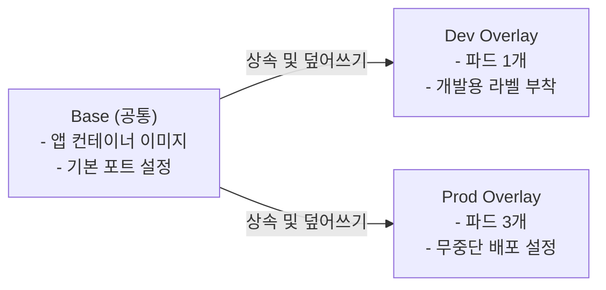

# Phase 2 - Step 1: Kustomize를 이용한 실무형 환경 분리 (Dev vs Prod)

## 🎯 실습 목표
- 실무에서는 테스트용 개발(Dev) 서버와 실제 운영(Prod) 서버의 설정이 명확히 다릅니다. (예: 개발은 파드 1개, 운영은 파드 3개)
- 이전 방식처럼 `dev-deployment.yaml`과 `prod-deployment.yaml`을 무식하게 따로 복사해서 만들면 관리가 지옥이 됩니다.
- **Kustomize**를 이용해 공통 설정(Base) 하나만 두고, 환경별로 필요한 부분만 영리하게 덮어쓰는(Overlay) 업계 표준 방식을 실습합니다.

---

## 💡 사전 지식 (Kustomize란?)
Kustomize는 별도의 설치 없이 `kubectl` 안에 내장된 템플릿 관리 도구입니다. `kustomization.yaml` 파일을 통해 여러 YAML 파일을 레고 블록처럼 조립해 줍니다.



---

## 🛠️ 실습 진행 단계

### Step 1. Kustomize Base 및 Overlay 파일 구성
공통 뼈대인 Base와 덮어쓰기용 Overlay(dev, prod) 파일들을 준비합니다. 
*(이 실습 파일들은 AI가 `manifests/hello-msa` 폴더 하위에 미리 세팅해 둡니다.)*

### Step 2. Kustomize 빌드 테스트 (터미널에서 결과 미리보기)
클러스터에 진짜로 배포하기 전에, Kustomize가 파일들을 어떻게 조합해 내는지 터미널에서 렌더링 결과만 확인해 봅니다.
```powershell
cd D:\VibeCoding2\Learning\MSA\Phase2_GitOps

# 1. 개발(Dev) 환경용 최종 YAML 조합 결과 보기
kubectl kustomize manifests/hello-msa/overlays/dev

# 2. 운영(Prod) 환경용 최종 YAML 조합 결과 보기
kubectl kustomize manifests/hello-msa/overlays/prod
```
👉 **결과 분석**: 화면에 출력된 텍스트를 자세히 살펴보세요. 동일한 Base를 상속받았음에도 불구하고, Dev는 `replicas: 1`이, Prod는 `replicas: 3`이 찍혀 나오는 놀라운 마법을 확인할 수 있습니다!

### Step 3. 클러스터에 배포 적용 (`-k` 옵션)
지금까지 우리는 파일 하나를 배포할 때 `-f` 옵션을 썼지만, 폴더 전체를 Kustomize로 조립해서 배포할 때는 `-k` 옵션을 사용합니다.
```powershell
# 개발 환경 배포!
kubectl apply -k manifests/hello-msa/overlays/dev

# 파드가 잘 떴는지 확인
kubectl get pods
```
