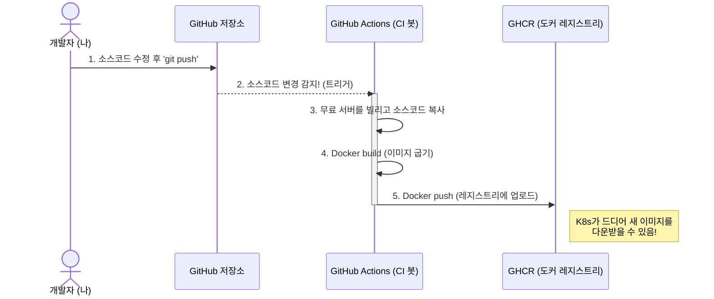

# Phase 2 - Step 2: GitHub Actions를 이용한 CI(지속적 통합) 자동화 파이프라인 구축

## 🎯 실습 목표
- 실무에서는 개발자가 일일이 로컬 터미널에서 `docker build`를 치고 `docker push`를 하지 않습니다.
- 소스 코드를 수정하고 깃허브에 올리기만 하면(Push), 깃허브 서버가 알아서 코드를 빌드하고 이미지를 구워 레지스트리(GHCR)에 올려주는 **자동화 공장(CI 봇)**을 만듭니다.

---

## 💡 아키텍처 (CI 파이프라인 동작 원리)



---

## 🛠️ 실습 진행 단계

### Step 1. CI 파이프라인 YAML 파일 확인
GitHub Actions는 레포지토리 내의 `.github/workflows/` 폴더 안의 YAML 파일을 감시하여 작동합니다. AI가 미리 `ci-pipeline.yaml`을 생성해 두었으니 열어서 구경해 보세요! (코드를 푸시할 때마다 이미지를 빌드하라는 아주 직관적인 지시어들이 들어있습니다.)

### Step 2. GitHub 저장소 생성 및 코드 업로드 (수동 작업)
이제 이 폴더(`Phase2_GitOps`) 전체를 통째로 회원님의 GitHub에 올려야 자동화 로봇이 작동합니다.
본인의 GitHub에 로그인하여 새로운 **Public 저장소**를 하나 만듭니다. (이름은 자유, 예: `hello-msa-gitops`)

그 다음, 로컬 터미널에서 아래 명령어들을 차례대로 입력하여 코드를 깃허브로 쏘아 올립니다.

> [!WARNING]
> 아래 명렁어 중 4번째 줄에 있는 `<본인의-깃허브-아이디>`와 `<저장소이름>`을 방금 만드신 본인 것으로 **반드시 변경해서 입력**하셔야 합니다!

```powershell
cd D:\VibeCoding2\Learning\MSA\Phase2_GitOps

# 1. 깃(Git) 저장소 초기화
git init

# 2. 모든 파일을 깃 장바구니에 담기
git add .

# 3. 장바구니에 이름표 붙이기 (커밋)
git commit -m "First commit for CI/CD"

# 4. 내 로컬 저장소와 깃허브 원격 저장소를 연결 (본인 주소로 수정 필수!)
git remote add origin https://github.com/<본인의-깃허브-아이디>/<저장소이름>.git

# 5. 깃허브로 쏘아 올리기!
git push -u origin master
```

### Step 3. GitHub 홈페이지에서 자동화 봇(Actions) 구경하기
코드를 푸시하고 나서, 본인의 GitHub 저장소 웹 페이지에 접속해 상단의 **[Actions]** 탭을 클릭해 보세요.
마치 공장 레일이 돌아가듯, 깃허브 서버가 스스로 리눅스 서버를 빌려와 Docker 이미지를 굽고 있는 짜릿한 광경(초록색 뱅글뱅글 아이콘)을 목격하실 수 있습니다!

### 🎉 결과 확인
이 작업이 끝나면 깃허브 프로필 우측 하단의 **[Packages]** 섹션에 `hello-msa` 라는 멋진 도커 이미지가 생성된 것을 볼 수 있습니다. 이 이미지가 바로 이전 실습(Step 1)에서 쿠버네티스가 찾지 못해 뱉었던 `ImagePullBackOff` 에러를 잠시 후 씻은 듯이 해결해 줄 구세주입니다!
