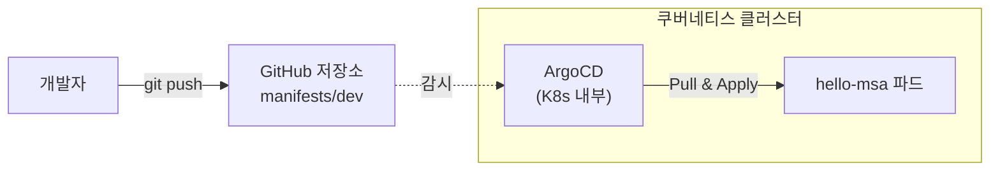

# Phase 2 - Step 3: ArgoCD를 이용한 GitOps (CD 지속적 배포) 구축

## 🎯 실습 목표
- 쿠버네티스 클러스터 내부에 **ArgoCD**라는 똑똑한 에이전트를 설치합니다.
- ArgoCD에게 "내 GitHub 저장소의 `manifests/hello-msa/overlays/dev` 폴더를 24시간 감시해!" 라고 지시합니다.
- 사람이 직접 `kubectl apply`를 치지 않아도, 깃허브에 새로운 코드가 푸시되면 클러스터가 스스로 변경 사항을 당겨와서(Pull) 적용하는 진정한 **GitOps**를 경험합니다.

---

## 💡 아키텍처 (CD 파이프라인 동작 원리)


*ArgoCD는 K8s 클러스터 내부에서 바깥(GitHub)을 지속적으로 바라보고 있습니다.*

---

## 🛠️ 실습 진행 단계

### Step 1. 클러스터에 ArgoCD 설치하기
ArgoCD 공식 설치 스크립트를 사용하여 네임스페이스를 만들고 설치합니다. (조금 깁니다!)
```powershell
# argocd 네임스페이스 생성
kubectl create namespace argocd

# 최신 안정화 버전(stable) 공식 매니페스트로 설치
kubectl apply -n argocd -f https://raw.githubusercontent.com/argoproj/argo-cd/stable/manifests/install.yaml

# 파드가 모두 뜰 때까지 확인 (보통 1~2분 소요)
kubectl get pods -n argocd
```

### Step 2. ArgoCD 접속하기 (포트 포워딩)
설치가 끝난 ArgoCD 웹 대시보드에 접속하기 위해 포트를 열어줍니다.
```powershell
kubectl port-forward svc/argocd-server -n argocd 8080:443
```
👉 브라우저를 열고 **https://localhost:8080** 로 접속합니다. (경고창이 뜨면 '안전하지 않음으로 이동' 혹은 '고급 -> 이동' 클릭)

### Step 3. ArgoCD 로그인 비밀번호 알아내기
ArgoCD의 기본 아이디는 `admin`입니다. 초기 비밀번호는 아래 명령어로 알아낼 수 있습니다. (포트 포워딩 창은 그대로 두고, 새 터미널을 열어서 입력하세요!)
```powershell
# 비밀번호를 추출 후 복호화하는 명령어 (Windows PowerShell 용)
$ARGO_PWD = kubectl -n argocd get secret argocd-initial-admin-secret -o jsonpath="{.data.password}"
[System.Text.Encoding]::UTF8.GetString([System.Convert]::FromBase64String($ARGO_PWD))
```
추출된 비밀번호로 `admin` 계정에 로그인합니다!

### Step 4. ArgoCD에 내 GitHub 저장소 연결하기 (앱 생성)
로그인 후, 화면 상단의 **[+ NEW APP]** 버튼을 눌러 아래 정보를 입력합니다.
*(UI가 복잡해 보이지만, 핵심은 '어떤 저장소의 어느 폴더를, K8s의 어디에 배포할래?' 입니다.)*

- **Application Name**: `hello-msa-dev`
- **Project**: `default`
- **SYNC POLICY**: `Automatic` (체크박스 두 개 모두 체크: `Prune Resources`, `Self Heal`)
- **Repository URL**: `본인의 GitHub 저장소 주소 (예: https://github.com/아이디/저장소명.git)`
- **Revision**: `main`
- **Path**: `manifests/hello-msa/overlays/dev`
- **Cluster URL**: `https://kubernetes.default.svc` (기본값)
- **Namespace**: `default`

모두 입력했다면 상단의 **[CREATE]** 버튼을 누릅니다!

### 🎉 결과 확인
생성 직후 ArgoCD 화면에 수많은 아이콘들이 거미줄처럼 연결되며 노란색에서 **초록색(Synced & Healthy)**으로 변하는 마법을 감상하세요! 이것이 바로 수많은 실무자들이 사랑하는 GitOps의 시각화 화면입니다. Kustomize의 렌더링을 알아서 수행하고 K8s에 깔끔하게 배포해 줍니다!
