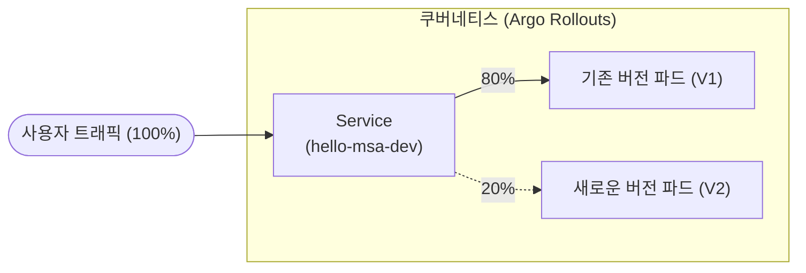

# Phase 2 - Step 4: 무중단 무결점 배포 (Argo Rollouts - Canary Deployment)

## 🎯 실습 목표
- 기존의 단순한 쿠버네티스 `Deployment`를 강력한 트래픽 제어 기능을 가진 **`Rollout`** 리소스로 마이그레이션합니다.
- 사용자의 트래픽 중 단 **20%**만 새로운 버전(V2)으로 흘려보내어 테스트하는 **카나리(Canary) 배포**를 실습합니다.
- Argo Rollouts CLI 및 대시보드를 통해 실시간 배포 현황을 눈으로 확인하고, 이상이 없으면 수동으로 100% 승격(Promote)시킵니다.

---

## 💡 아키텍처 및 개념 (카나리 배포란?)

새로운 버전(V2)을 배포할 때, 기존 버전(V1)을 한 번에 다 꺼버리는 것은 매우 위험합니다. 옛날 광부들이 유독가스를 확인하기 위해 카나리아(새)를 데리고 갱도에 들어갔던 것처럼, **일부 트래픽(예: 20%)만 V2로 보내어 에러가 없는지 간을 보는 배포 방식**을 카나리 배포라고 합니다.



---

## 🛠️ 실습 진행 단계

### Step 1. 클러스터에 Argo Rollouts 컨트롤러 설치
ArgoCD처럼 클러스터 내부에 Rollouts 기능을 관장하는 뇌(Controller)를 설치해야 합니다.

```powershell
# argo-rollouts 네임스페이스 생성
kubectl create namespace argo-rollouts

# 공식 매니페스트를 통한 설치
kubectl apply -n argo-rollouts -f https://github.com/argoproj/argo-rollouts/releases/latest/download/install.yaml

# 파드가 모두 뜰 때까지 확인
kubectl get pods -n argo-rollouts
```

### Step 2. Argo Rollouts 플러그인(CLI) 설치
배포 상태를 터미널과 예쁜 대시보드로 보기 위해 윈도우용 플러그인을 설치합니다. (PowerShell 관리자 권한 권장)

```powershell
# 다운로드
Invoke-WebRequest -Uri https://github.com/argoproj/argo-rollouts/releases/latest/download/kubectl-argo-rollouts-windows-amd64 -OutFile kubectl-argo-rollouts.exe

# (선택) 다운받은 exe 파일을 환경변수 PATH가 잡힌 폴더로 이동시키면 좋지만,
# 편의상 현재 폴더에서 바로 사용하려면 아래와 같이 테스트해 봅니다.
.\kubectl-argo-rollouts.exe version
```

### Step 3. K8s 매니페스트 수정 (Deployment ➡️ Rollout)
GitOps의 진수를 맛볼 차례입니다! 기존의 `deployment.yaml`을 버리고, 카나리 전략이 포함된 `Rollout` 리소스로 교체합니다.

1. `manifests/hello-msa/base/deployment.yaml` 파일의 이름을 **`rollout.yaml`** 로 변경합니다.
2. `rollout.yaml`의 내용을 아래와 같이 통째로 덮어씁니다. (kind가 Rollout으로 바뀌고 strategy가 추가됨)

```yaml
apiVersion: argoproj.io/v1alpha1
kind: Rollout
metadata:
  name: hello-msa-dev
  labels:
    app: hello-msa
spec:
  replicas: 5 # 카나리 비율을 명확히 보기 위해 파드 개수를 5개로 늘립니다.
  selector:
    matchLabels:
      app: hello-msa
  template:
    metadata:
      labels:
        app: hello-msa
    spec:
      containers:
      - name: hello-msa
        image: ghcr.io/bitmool/k8s-gitops-practice/hello-msa:latest # 🚨 본인의 이미지 경로가 맞는지 확인!
        ports:
        - containerPort: 3000
  # 👇 여기서부터 카나리 배포 전략 설정!
  strategy:
    canary:
      steps:
      - setWeight: 20  # 1단계: 새 버전으로 트래픽의 20%만 보냄
      - pause: {}      # 2단계: 관리자가 수동으로 승인(Promote)할 때까지 무기한 대기!
      - setWeight: 50  # 3단계: 승인되면 50%로 늘림
      - pause: {duration: 10} # 4단계: 10초 동안 자동 대기 후
      # 5단계: 완료 (나머지 100% 전환)
```

3. `manifests/hello-msa/base/kustomization.yaml` 파일도 열어서 리소스 이름을 변경해 줍니다.
```yaml
apiVersion: kustomize.config.k8s.io/v1beta1
kind: Kustomization

resources:
- rollout.yaml # deployment.yaml 에서 수정!
- service.yaml
```

4. **[매우 중요🚨] Kustomize 패치 타겟 수정**
오버레이(환경별 덮어쓰기) 파일인 `manifests/hello-msa/overlays/dev/patch.yaml` 과 `prod/patch.yaml` 도 타겟을 수정해야 합니다. 
두 파일 모두 최상단의 `kind: Deployment` 와 `apiVersion` 을 다음과 같이 **`Rollout`** 으로 수정해 줍니다.
```yaml
# 수정 전: apiVersion: apps/v1, kind: Deployment
apiVersion: argoproj.io/v1alpha1
kind: Rollout
metadata:
  name: hello-msa
# 이하 내용은 그대로 유지
```

### Step 4. 깃허브에 Push (GitOps 발동)
로컬에서 변경한 인프라 코드를 깃허브에 올립니다.
```powershell
git add .
git commit -m "Migrate Deployment to Argo Rollout for Canary"
git push
```
👉 이제 ArgoCD 화면을 보시면, 기존 Deployment는 지워지고 5개의 파드를 가진 **Rollout**이 새로 생성되는 것을 볼 수 있습니다!

### Step 5. 카나리 배포 시각화 대시보드 띄우기
새 터미널을 열고 아래 명령어로 대시보드를 띄웁니다.
```powershell
# 주의: 아까 다운받은 kubectl-argo-rollouts.exe 가 있는 폴더에서 실행
.\kubectl-argo-rollouts.exe dashboard
```
👉 브라우저에서 `http://localhost:3100` 에 접속하시면, 5개의 파드가 모두 V1으로 떠 있는 것을 볼 수 있습니다.

### Step 6. 대망의 카나리 배포 테스트 (V2 배포)
이제 소스코드를 수정해서 진짜 카나리 배포가 어떻게 동작하는지 눈으로 확인해 봅니다!

1. `apps/hello-msa/app.js` 파일을 열고, 8번째 줄의 응답 텍스트를 V2로 바꿉니다.
   ```javascript
   // 수정 전
   res.send(`<h1>Hello MSA GitOps! 🚀</h1>...`);
   // 수정 후
   res.send(`<h1>Hello MSA GitOps! V2 카나리 테스트!! 🐤</h1>...`);
   ```
2. 변경된 코드를 깃허브에 푸시합니다!
   ```powershell
   git add .
   git commit -m "Update app to V2 for Canary test"
   git push
   ```
3. **결과 확인 (GitOps 마법 콤보):**
   - GitHub Actions가 윙윙 돌며 새로운 V2 도커 이미지를 만듭니다.
   - 빌드가 완료되면 ArgoCD가 이를 감지하고 Rollout을 업데이트합니다.
   - **Argo Rollouts 대시보드(`http://localhost:3100`)를 쳐다보세요!** 
   - 5개의 파드 중 딱 1개(20%)만 V2 이미지로 갱신되고, 진행이 **Paused(일시 정지)** 상태로 멈출 것입니다!
   - 브라우저로 `http://localhost:8081` (Step 3의 포트포워딩)을 계속 새로고침 해보면, 5번 중 1번 꼴로 🐤V2 화면이 나오고 나머지는 V1 화면이 나옵니다.

### Step 7. 문제 없음 확인! 전체 승격(Promote)
20%의 트래픽을 관찰한 결과 에러가 없다고 판단되었습니다. 이제 나머지 80%도 마저 업데이트 시킵니다.

- **대시보드 UI에서:** 대시보드 우측 상단의 파란색 **[Promote]** 버튼을 클릭합니다.
- **또는 터미널에서:** `.\kubectl-argo-rollouts.exe promote hello-msa-dev` 입력

👉 남은 4개의 파드가 순차적으로 V2로 교체되며 100% 배포가 완료되는 아름다운 광경을 감상하시면 됩니다! 🎉
